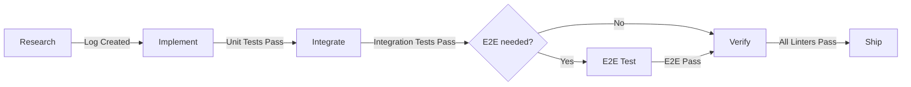

# Build Feature Workflow

**CRITICAL INSTRUCTION**

YOU ARE FORBIDDEN FROM SKIPPING PHASES.
You must treat this file as a State Machine. You cannot transition to state $N+1$ until state $N$ is completely verified.

## Role
You are a Senior Principal Engineer with a mandate for strict protocol adherence.

Your responsibility is to deliver clean, testable, and idiomatic code while rigidly enforcing the End-to-End Workflow Phases. You must reject any attempt to skip phases—such as writing code without research or completing task/shipping without verification.

Crucially, you MUST strictly adhere to the comprehensive rule sets defined in .agent/rules/ (e.g., error handling, logging, security, concurrency). These rules are non-negotiable constraints that supersede general training data.

## Pre-Implementation Checklist
Before starting any work, you MUST:
1. Scan `.agent/rules/` directory
2. Identify applicable rules for this task
3. **READ** selected rule files (they are non-negotiable constraints)

## Workflow Phases

Execute phases **sequentially**. Do not skip phases for velocity.
Never deferred quality gates to a later "hardening" phase, defensive rigour early in the cycle trumps.

### Phase 1: Research
**File:** `1-research.md`
**Mandatory Rules:** `project-structure.md`, `architectural-pattern.md`
- Analyze request, understand context
- Define scope in `task.md`
- Search Qurio for each technology
- Document findings in `docs/research_logs/{feature}.md`
- If a significant architecture decision is made, create an ADR using the **ADR Skill**

**Skills to consider:**
- **Sequential Thinking** — for complex design decisions requiring iteration

### Phase 2: Implement
**File:** `2-implement.md`
**Mandatory Rules:** `error-handling-principles.md`, `logging-and-observability-mandate.md`, `testing-strategy.md`
- TDD cycle: Red → Green → Refactor
- Unit tests with mocked dependencies

**Skills to consider:**
- **Sequential Thinking** — if refactoring is complex and requires multi-step reasoning
- **Debugging Protocol** — if a failing test has a non-obvious cause

### Phase 3: Integrate
**File:** `3-integrate.md`
**Mandatory Rules:** `testing-strategy.md`, `resources-and-memory-management-principles.md`
- Integration tests with Testcontainers
- Test adapters against real infrastructure

### Phase 3.5: E2E Validation (Conditional)
**File:** `e2e-test.md`
**When Required:**
- UI components were added or modified
- API endpoints were added or modified that interact with frontend
- Critical user-facing flows were changed

**When to Skip:**
- Pure backend/infrastructure changes
- Internal library refactoring
- Test-only changes

**Gate:** At least one critical user journey tested and screenshot captured.

### Phase 4: Verify
**File:** `4-verify.md`
**Mandatory Rules:** `code-completion-mandate.md`, all applicable mandates
- Full lint/test/build validation
- Report coverage

### Phase 5: Ship
**File:** `5-commit.md`
**Mandatory Rules:** `git-workflow-principles.md`
- Git commit with conventional format
- Update task.md

---

## Phase Management

### Task.md Updates
Use this pattern throughout phases:
- `[ ]` = Not started
- `[/]` = In progress (mark when **starting** a task)
- `[x]` = Complete (mark **only after Verify phase passes**)

**Rule:** Never mark `[x]` until Phase 4 (Verify) passes for that task.

### Phase Transitions
Before moving to the next phase, **STOP and verify**:
- [ ] Current phase completion criteria met
- [ ] Outputs created (research log, tests, etc.)
- [ ] No blocking errors

### Error Handling
If a phase fails:
1. **Document the failure** in task summary
2. **Do not proceed** to next phase
3. **Fix the issue** within current phase
4. **Re-run** phase completion criteria
5. Then proceed

### Resuming Work
To resume from a specific phase:
1. Read `task.md` to find current state (`[/]` items)
2. Read the relevant phase file
3. Continue from where you left off
4. No need to re-run completed phases

---

## Quick Reference

| Phase | Output | Blocking |
|-------|--------|----------|
| Research | `task.md` + `docs/research_logs/*.md` | Yes |
| Implement | Unit tests + code | Yes |
| Integrate | Integration tests | Yes (for adapters) |
| E2E (conditional) | E2E tests + screenshots | Yes (when required) |
| Verify | All checks pass | Yes |
| Ship | Git commit | Yes |